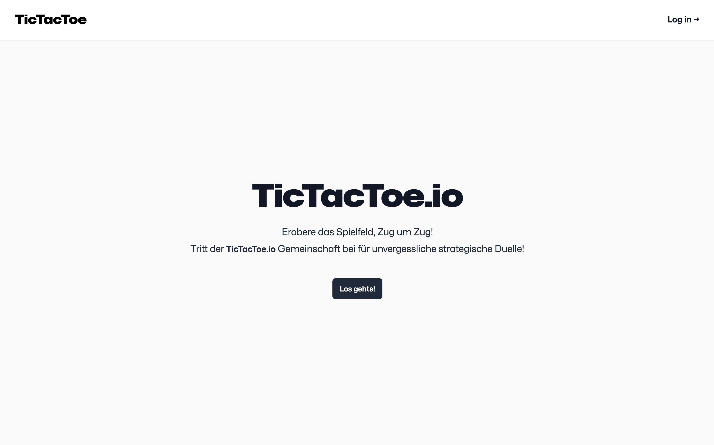
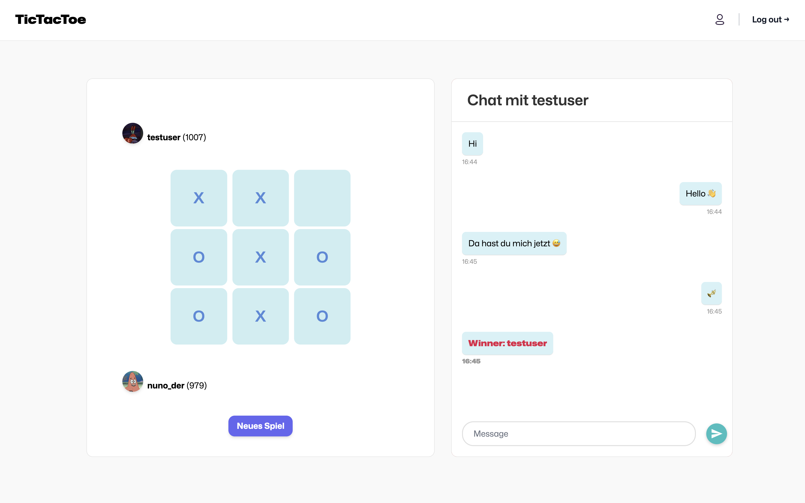
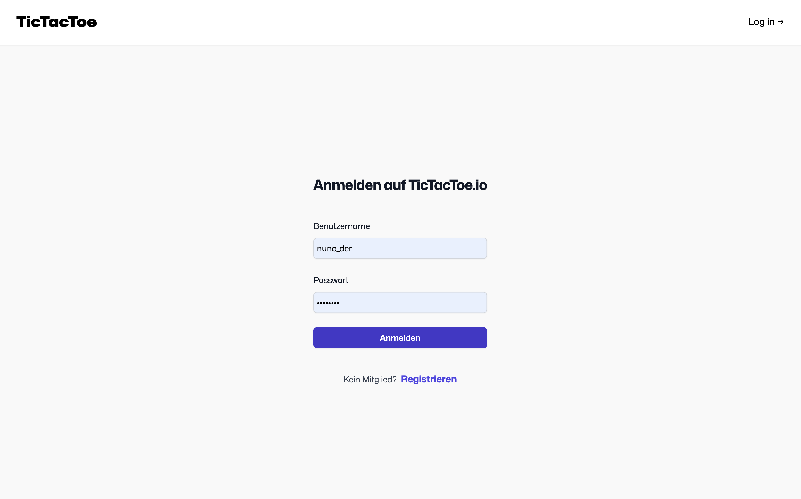

# TicTacToe




## Running the app
To run the platform locally 
1. run the ```./run.sh``` shell script
2. Open the page on ```localhost:3000```
3. To play a game on the same computer use another browser or incognito mode to have two sessions running